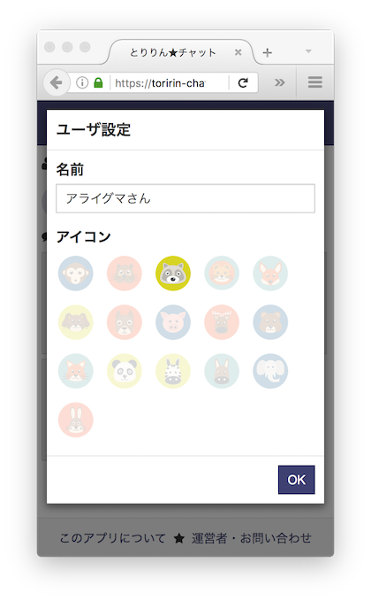
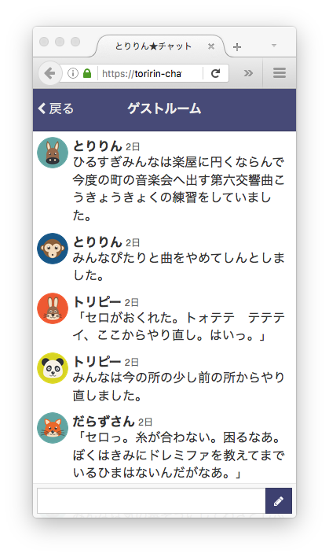
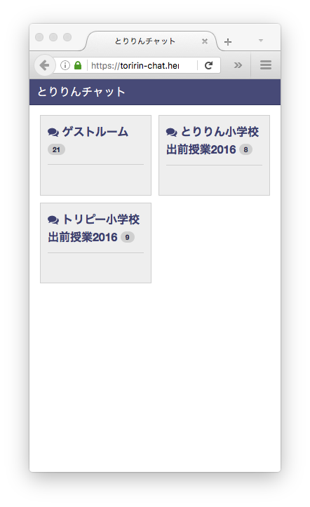
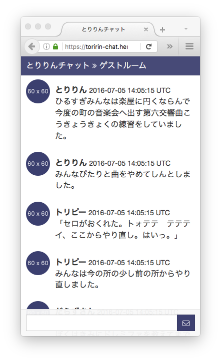
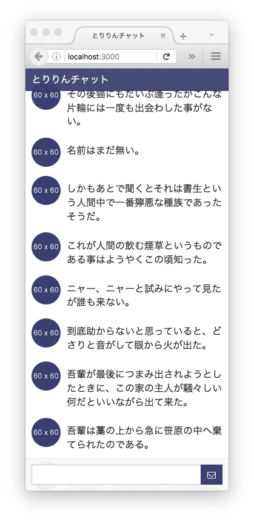

# Toririn Chat (とりりんチャット)

This chat system currently is under development. This is a chat system to conduct classes about information education for children in local area network. Children can learn safe usage of SNS (social networking service) in safe local area network.

Demo Site https://toririn-chat.herokuapp.com/

[](https://heroku.com/deploy?template=https://github.com/mh61503891/toririn-chat)

## 2016-07-09

* Support for user accounts (cookies' session only)
* Add the home page
* Add the about page





## 2016-07-07

* Support for ActionCable with Turbolinks
* Support for users' icon
* Support for displaying a user information on the root_path page
* Change the icon of the button to submit a message from :envelope to :pencil



## 2016-07-06

* Support for chat rooms
* Support for displaying user names and timestamps in a chat room




## 2016-07-03

* Support for messaging via WebSocket



## References

[JSPS科研費16K01114](https://kaken.nii.ac.jp/ja/grant/KAKENHI-PROJECT-16K01114/)

## Development

```bash
$ bundle install
$ bundle exec rails server -b 0.0.0.0
```

```bash
$ open http://localhost:3000/
```

```bash
$ bundle exec guard
```
