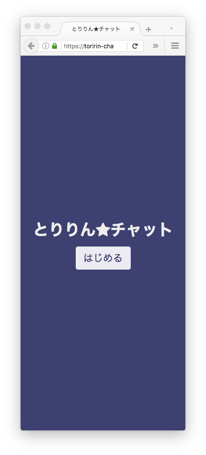
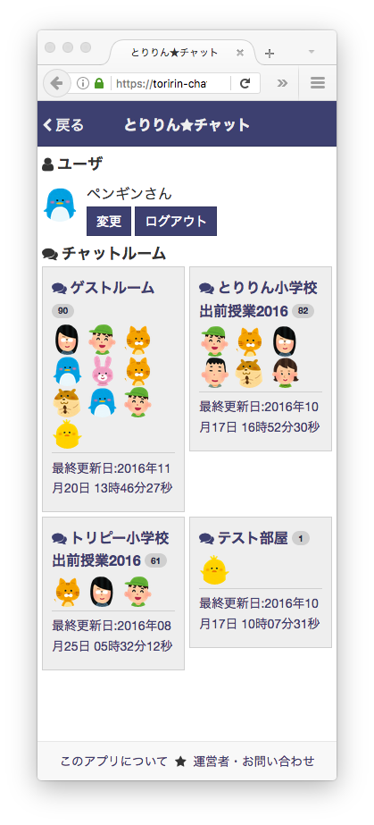
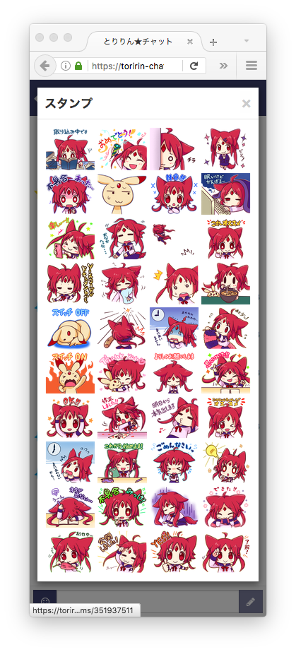
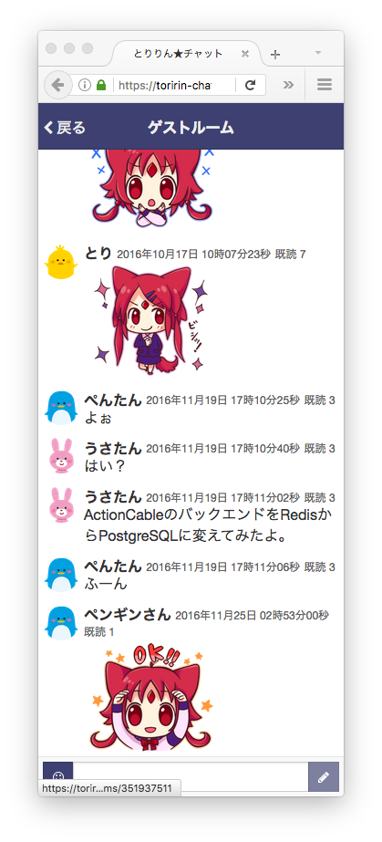

# Toririn Chat (とりりんチャット)

This chat system currently is under development. This is a chat system to conduct classes about information education for children in local area network. Children can learn safe usage of SNS (social networking service) in safe local area network.

Demo Site https://toririn-chat.herokuapp.com/

[](https://heroku.com/deploy?template=https://github.com/mh61503891/toririn-chat)

## 2016-11-25

* Support stamps ([Rubicle LINE stamp](http://rubicle.net/line_stamp.html))
* Support 'Deploy to Heroku' Button
* Add default data of seeds
* Support foreman with '.env'
* Change icons to [Irasutoya](http://www.irasutoya.com/)
* Migrate a CSS pre-processor from LESS to SASS
    * Migrate a CSS framework from twitter-bootstrap-rails to bootstrap-sass
* Change the default backend database for ActionCable from Redis to PostgreSQL
* Support Guard for development
* Support messages' status







## 2016-07-09

* Support for user accounts (cookies' session only)
* Add the home page
* Add the about page


## 2016-07-07

* Support for ActionCable with Turbolinks
* Support for users' icon
* Support for displaying a user information on the root_path page
* Change the icon of the button to submit a message from :envelope to :pencil


## 2016-07-06

* Support for chat rooms
* Support for displaying user names and timestamps in a chat room


## 2016-07-03

* Support for messaging via WebSocket


## References

[JSPS科研費16K01114](https://kaken.nii.ac.jp/ja/grant/KAKENHI-PROJECT-16K01114/)

## Installation

### git clone

```bash
$ git clone https://github.com/mh61503891/toririn-chat.git¬
```

### bundle install

```bash
$ cd toririn-chat
$ bundle config --local build.pg --with-pg-config=/Applications/Postgres.app/Contents/Versions/latest/bin/pg_config
$ bundle config --local build.nokogiri --use-system-libraries
$ bundle install
```

### .env

```bash
$ cp .env.example .env
```

```bash
$ cat .env
PORT=80
DATABASE_URL=postgres://postgres:@localhost:5432/toririn-chat_production
TZ=Asia/Tokyo
LANG=ja_JP.UTF-8
RAILS_ENV=production
RAILS_SERVE_STATIC_FILES=enabled
RAILS_LOG_TO_STDOUT=enabled
DISABLE_DATABASE_ENVIRONMENT_CHECK=1
```

Set `SECRET_KEY_BASE` to a generated secret key via `bundle exec rails secret`.

```bash
$ echo "SECRET_KEY_BASE=`bundle exec rails secret`" >> .env
```

### database

```bash
$ bundle exec foreman run rails db:migrate:reset
$ bundle exec foreman run rails db:seed
```

### asserts

```bash
$ bundle exec foreman run rails assets:precompile
```

### start

```bash
$ sudo bundle exec foreman start
```

## Development

```bash
$ bundle install
$ bundle exec rails server -b 0.0.0.0
```

```bash
$ open http://localhost:3000/
```

```bash
$ bundle exec guard
```

Generate License Finder's Repost.

```bash
bundle exec license_finder report --format html > doc/licenses.html
```
